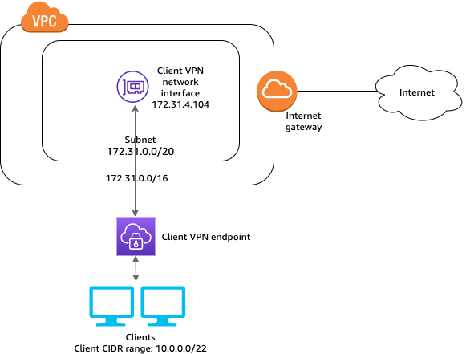

---

copyright:
  years: 2015, 2022
lastupdated: "2022-03-01"

keywords: IBM Event Streams, Kafka as a service, managed Apache Kafka, AWS, location, VPN

subcollection: EventStreams

---

{:codeblock: .codeblock}
{:important: .important}
{:note: .note}
{:pre: .pre}
{:beta: .beta}
{:shortdesc: .shortdesc}
{:external: target="_blank" .external}
{:step: data-tutorial-type='step'}
{:tutorial: data-hd-content-type='tutorial'}

# Connecting applications running outside AWS with VPN access to the Satellite location
{: beta}
{: #satellite_vpn}

To connect applications running outside Amazon Web Services (AWS) with VPN access to the Satellite location to an {{site.data.keyword.messagehub}} instance, complete the following set of steps.
{: beta}

{: caption="Figure 1. Diagram showing an app connecting to clients using a VPN endpoint " caption-side="bottom"}

## Step 1: Set up the Satellite plan for {{site.data.keyword.messagehub_full}} in a Satellite location using AWS
{: #prepare-satellite-aws}
{: step}

Complete the steps in [Getting started with the Satellite plan for Event Streams](/docs/EventStreams?topic=EventStreams-satellite_getting_started){: external} to set up the plan for {{site.data.keyword.messagehub}} in a Satellite location that is using AWS infrastructure.

## Step 2: Create a Client VPN endpoint
{: #create_vpn_endpoint}
{: step}

   a. Create a Client VPN endpoint that does the following:
      * Provides all clients access to a single VPC.
      * Provides all clients access to the internet.
      * Uses mutual authentication.
   b. Complete the steps detailed in [Getting started with Client VPN](https://docs.aws.amazon.com/vpn/latest/clientvpn-admin/cvpn-getting-started.html){: external}.

## Step 3: Test the {{site.data.keyword.messagehub}} producer and consumer sample applications
{: #test_sample_apps}
{: step}

Complete the steps detailed in [{{site.data.keyword.messagehub}} Getting Started](/docs/EventStreams?topic=EventStreams-getting-started){: external} to ensure that you can run these sample applications successfully.

## Step 4: Test the {{site.data.keyword.messagehub}} CLI
{: #test_cli}
{: step}

Complete the steps detailed in [{{site.data.keyword.messagehub}} CLI reference](docs/EventStreams?topic=EventStreams-cli_reference).

**Question:** Is the suggestion that the user runs a few of these commands as a test? There are no steps as such in the CLI topic.
{: note}
