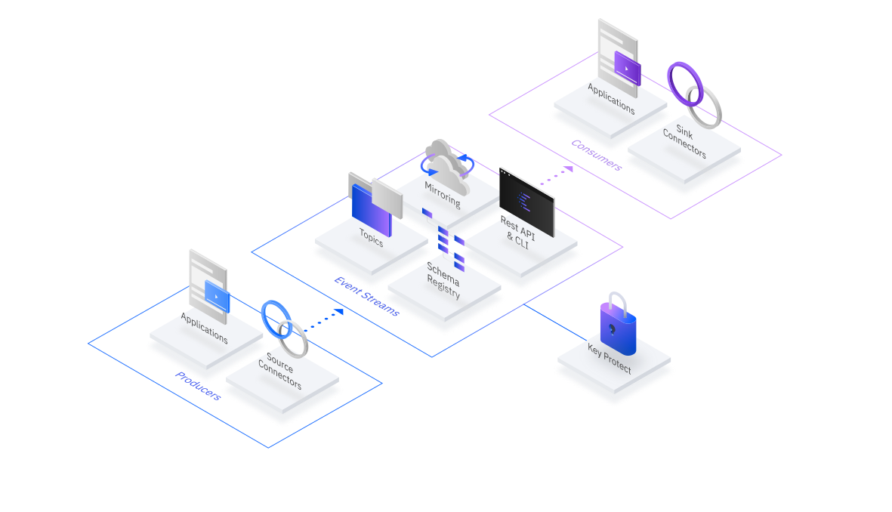

---

copyright:
  years: 2015, 2023
lastupdated: "2023-06-29"

keywords: Cloud Object Storage, query, streaming, stream landing

subcollection: EventStreams

---

{:external: target="_blank" .external}
{:shortdesc: .shortdesc}
{:screen: .screen}
{:codeblock: .codeblock}
{:pre: .pre}
{:note: .note}

# Streaming to Cloud {{site.data.keyword.cos_short}} by using {{site.data.keyword.sqlquery_short}}
{: #streaming_cos_sql}

Extend your data pipeline to Cloud {{site.data.keyword.cos_full}} to easily archive data for long-term storage or to gain insight by leveraging interactive queries or big data analytics. From the {{site.data.keyword.messagehub}} UI, topics can be selected and linked to Cloud {{site.data.keyword.cos_short}} buckets, with data automatically and securely streamed by using the fully managed {{site.data.keyword.sqlquery_full}} service. All data is stored in Parquet format, making it easy to manage and process.
{: shortdesc}

{: caption="Figure 1. Diagram showing streaming to Cloud Object Storage by using {{site.data.keyword.sqlquery_short}}" caption-side="bottom"}

The following task walks you through:

- Creating the required services.
- Setting up Cloud {{site.data.keyword.cos_short}} landing by using {{site.data.keyword.sqlquery_short}}.
- Verifying that the events are stored in {{site.data.keyword.cos_short}}.

{{site.data.keyword.sqlquery_short}} consumes batches of events from Kafka and stores the data as Parquet objects in the Cloud {{site.data.keyword.cos_short}} service. The process is triggered in the background by {{site.data.keyword.messagehub}} submitting an SQL landing statement to {{site.data.keyword.sqlquery_short}}.

Complete the following steps to start the streams landing.

## Step 1. Prerequisites
{: #step1_install_prereqs_cos}

Ensure that you configured the following services:

- An {{site.data.keyword.messagehub}} instance - Standard or Enterprise plan. You must create credentials.
- A Cloud {{site.data.keyword.cos_short}} instance with at least one bucket.
- A {{site.data.keyword.sqlquery_short}} instance - Standard plan.
- An {{site.data.keyword.keymanagementservicelong}} instance.

These services can also be created after you start configuring your stream landing job in the set-up wizard.

Ensure that you have the following permissions:

- Permission to create service-to-service authentication.
- Permission to create service IDs and API keys.
- Permission to write to {{site.data.keyword.keymanagementservicelong}} (to store the API key).
- Reader access role for the cluster, topic and group resources within the {{site.data.keyword.messagehub}} service instance (or a Reader access role for the service instance as a whole).
- Writer role for the Cloud {{site.data.keyword.cos_short}} bucket.

## Step 2. Set up the Cloud {{site.data.keyword.cos_short}} stream landing
{: #step2_setup_cos_landing}

1. Click the **Overflow menu** (three vertical dots next to the topic) to start and select the **streaming** topic data option to see the streams landing overview page.
2. Click **Start** to start the wizard.
3. Select the required Cloud {{site.data.keyword.cos_short}} instance, then click **Next**.
4. Within the Cloud {{site.data.keyword.cos_short}} instance, select the bucket where you want the events to be stored, then click **Next**.
5. Select the {{site.data.keyword.sqlquery_short}} instance. Only instances with a Standard plan are listed.
6. Configure the streams landing by completing the following steps:

   - Define the prefix of the {{site.data.keyword.cos_short}} objects.
   - Specify the event format (JSON).
   - Create or select a service ID with the correct IAM access policies. This service ID is used to create an API key.
   - Select a {{site.data.keyword.keymanagementservicelong}} instance to store the new API key that can be used later by {{site.data.keyword.sqlquery_short}} to run the landing until you stop it again.
   - Click **Start streaming data** to enable a stream landing job.

## Step 3. Validate that your stream landing job is working
{: #step3_validate_landing}

To validate that streams landing is working, complete the following steps:

- Verify that the specified prefix in {{site.data.keyword.cos_short}} is filled with Parquet objects.
- Check the status of all streaming jobs in the {{site.data.keyword.sqlquery_short}} UI.
- Alternatively, use the REST API of {{site.data.keyword.sqlquery_short}} to get the list and the details of running stream landing jobs.
- In the {{site.data.keyword.messagehub}} UI, you also get information about the active stream landing jobs per topic. Using {{site.data.keyword.messagehub}}, you can view and stop the landing configuration.

## Estimating cost
{: #estimating-cost}

You can evaluate the cost of your own planned usage with the 
[{{site.data.keyword.Bluemix_notm}} cost estimator](https://cloud.ibm.com/estimator){: external}

## Limitations
{: #limitations-streams-landing}

- With {{site.data.keyword.sqlquery_short}} you can process up to 1 MB event data per second. The final reached data throughput depends on parameters, such as topic partitions, and size and format of the events. 
- For one {{site.data.keyword.sqlquery_short}} instance, the limit is five concurrent stream landing jobs. The limit can be raised upon request by a support ticket. 
- The {{site.data.keyword.messagehub}} feature is available only for {{site.data.keyword.sqlquery_short}} instances that are created in the US-South region and in Frankfurt. 

For more information, see [Streaming to Cloud Object Storage by using {{site.data.keyword.sqlquery_short}}](/docs/sql-query?topic=sql-query-event-streams-landing) in the {{site.data.keyword.sqlquery_short}} documentation.
