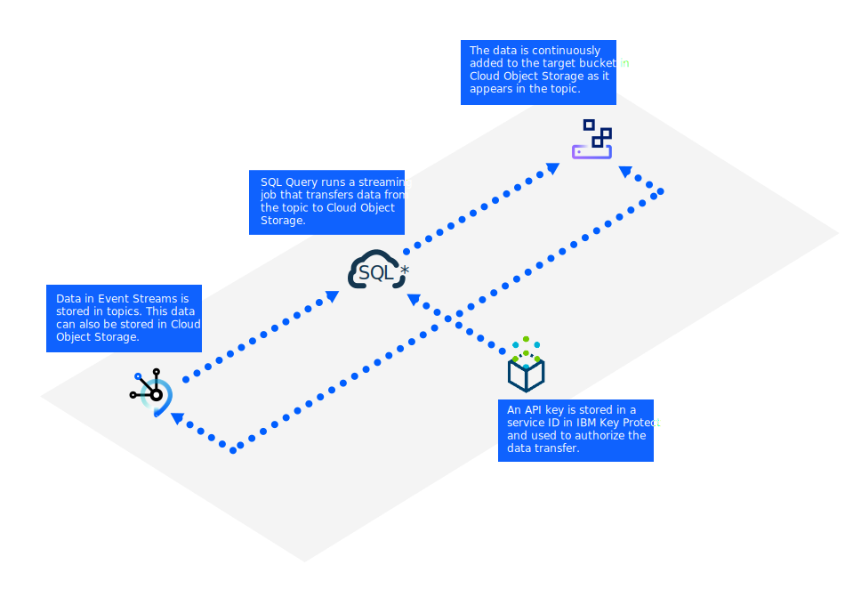

---

copyright:
  years: 202!
lastupdated: "2021-05-06"

keywords: Cloud Object Storage, SQL query, streaming

subcollection: EventStreams

---

{:new_window: target="_blank"}
{:shortdesc: .shortdesc}
{:screen: .screen}
{:codeblock: .codeblock}
{:pre: .pre}
{:note: .note}

# Streaming to Cloud {{site.data.keyword.cos_short}} by using {{site.data.keyword.sqlquery_short}}
{: #streaming_cos_sql}

The following task walks you through:

- Creating the required services.
- Setting up {{site.data.keyword.cos_full}} landing using {{site.data.keyword.sqlquery_full}}.
- Verifying that the events are stored in {{site.data.keyword.cos_short}}.

{{site.data.keyword.sqlquery_short}} consumes batches of events from Kafka and stores the data as Parquet objects in the 
{{site.data.keyword.cos_short}} service. The process is triggered by submitting an SQL landing statement to {{site.data.keyword.sqlquery_short}}.

Complete the following steps to start the streams landing. 

## Step 1. Install the prerequisites
{: #step1_install_prereqs}

Ensure you have the following software and services installed:

- An {{site.data.keyword.messagehub}} instance - Standard or Enterprise plan. You will need to create credentials.
- A Cloud {{site.data.keyword.cos_short}} instance with at least one bucket.
- An {{site.data.keyword.sqlquery_short}} instance - Standard plan.
- A {{site.data.keyword.keymanagementservicelong}} instance.

## Step 2. Set up the Cloud {{site.data.keyword.cos_short}} landing
{: #step2_setup_cos_landing}

1. Click on the Overflow menu (3 vertical dots beside the topic) to start and select the *streaming* topic data option 
in order to see the streams landing overview page.
2. Click *Start* to start the wizard.
3. Select the required Cloud {{site.data.keyword.cos_short}} instance, then click *Next*. 
4. Within the Cloud {{site.data.keyword.cos_short}} instance, select the bucket where the events should be stored, then click *Next*.
5. Select the {{site.data.keyword.sqlquery_short}} instance. Only instances with a Standard plan are listed.
6. Configure the streams landing by completing the following steps:
 
  - Define the prefix of the {{site.data.keyword.cos_short}} objects.
  - Specify the event format (JSON or AVRO).
  - Specify the optional event size.
  - Create or select a service ID with the correct IAM access policies. This service ID is used to create an API key.
  - Select a {{site.data.keyword.keymanagementservicelong}} instance to store the new API key that can be used later by {{site.data.keyword.sqlquery_short}} to run the landing until you stop it again.
  - Click *Start streaming data* to start the landing.

## Step 3. Validate that streams landing is working
{: #step5_validate_landing}

To validate that streams landing is working:

  - Verify that the specified prefix in {{site.data.keyword.cos_short}} is filled with Parquet objects.
  - Check the status of all streaming jobs in the {{site.data.keyword.sqlquery_short}} UI.
  - Alternatively, use the REST API of {{site.data.keyword.sqlquery_short}} to get the list and the details of running streaming jobs. 
  - In addition to the topic in the {{site.data.keyword.messagehub}} UI, you also get information about the active landing. Using {{site.data.keyword.messagehub}}, you can view and stop the landing configuration.

For more information, see [Streaming to Cloud Object Storage by using SQL Query](/docs/sql-query?topic=sql-query-kafka-event-streams-landing) in the {{site.data.keyword.sqlquery_short}} documentation.
